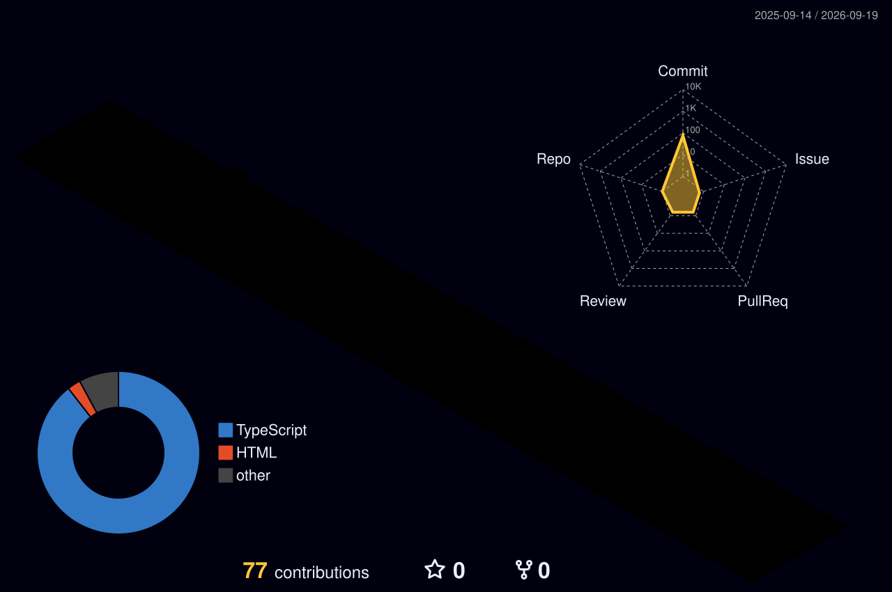

<h1 align="center">Hi there, I'm Akshay! 👋</h1>

  

  
  
  

<table>
<tr>
<td valign="top" width="50%">

### 👨‍💻 About Me

- 🎓 **AIML Student** passionate about solving real-world problems using AI.
- 💻 **Frontend Developer** building modern, interactive web applications.
- 🤖 Currently working on **AI-powered systems & Django backend projects**.
- 📚 Currently learning: **React, Advanced JavaScript, & Machine Learning**.
- 🚀 **Goal:** Build Industry-Level AI Products & Start My Own Tech Startup.

</td>
<td valign="top" width="50%">

### 🤝 Connect With Me

</td>
</tr>
</table>

## 🧠 Current Focus & Projects

| | |
|---|---|
| 🤖 **[AI Campus Copilot](https://github.com/akshaycp05/college-portal)** Autonomous College Assistant automating student queries & tasks. | 📄 **[AI Resume Analyzer](https://github.com/akshaycp05/resume-analyzer)** Smart tool analyzing resumes with a built-in Interview Coach. |
| 📈 **[Predictive Analytics](https://github.com/akshaycp05/AI-Student-Dropout-Prediction-App)** Smart ML models for Student Success & performance prediction. | 👁️ **[Face Recognition](https://github.com/akshaycp05/attendance-website)** Automated secure Attendance System using advanced Computer Vision. |

## 🛠️ Tech Stack & Tools

**Languages**
 

**Frameworks & Libraries**
 

**Databases & Tools**
 

## 📊 GitHub Metrics

## 🧊 3D Contribution Calendar

